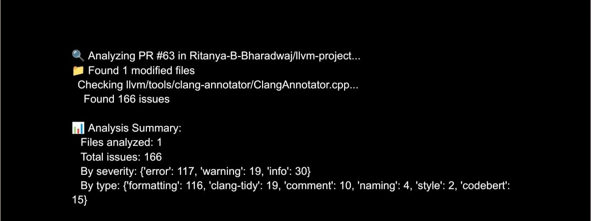
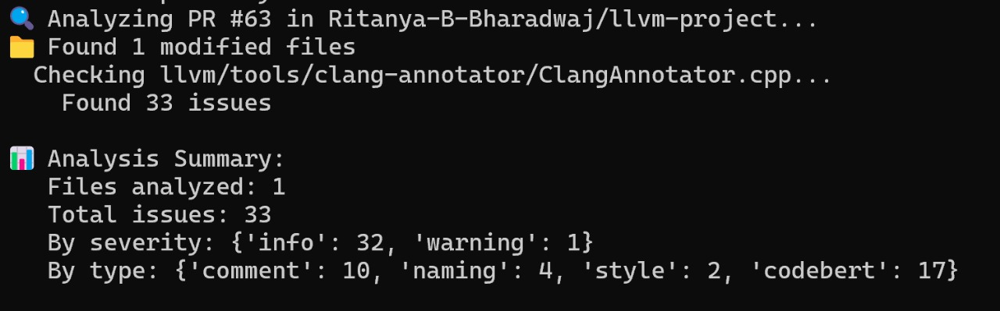
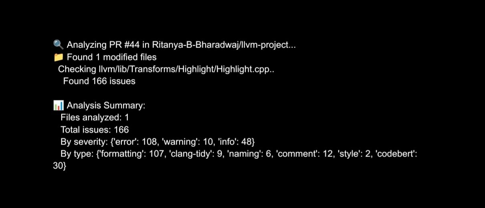
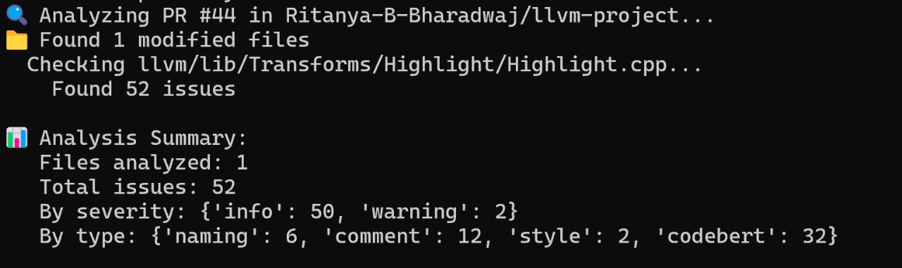

# LLVM Pull Request Compliance Checker Tool

This tool automatically reviews LLVM pull requests for compliance with LLVM coding standards. It focuses only on **modified lines** and combines traditional linters with **GenAI-based code suggestions** to assist contributors and maintainers in improving code quality.

---

## 🔍 What It Does

- ✅ Checks formatting using `clang-format` (on modified lines only)
- 🔍 Runs `clang-tidy` on changed files and filters results to modified lines
- 🧠 Applies custom rules for:
  - Naming conventions
  - Comment quality
  - Header/license checks
- 🤖 Uses GenAI to:
  - Suggest improvements
  - Explain issues in human-readable language

---

## 📊 Tool Output Comparison

### Before Enhancement:


### After Enhancement:


### Additional Comparison:

**Before:**


**After:**


---

## 🛠️ Requirements

- Python 3.8+
- Git installed and configured
- `clang-format` and `clang-tidy` available in PATH
- LLVM repository cloned locally (prebuilt with `clang-tidy` support)
- GitHub personal access token

---

## 📁 Tool Location

> ⚠️ The `llvm-pr-checker.py` script must remain in the **root directory** of the `llvm-project` repository because it relies on relative paths used during LLVM development.

---

## 🚀 Usage

Run the tool from the root of your cloned LLVM repository using:

```bash
python llvm-pr-checker.py --repo <llvm_github_repo> --pr <PR_NUMBER> --github-token <GITHUB_TOKEN> --openai-key <OPENAI_KEY>
```