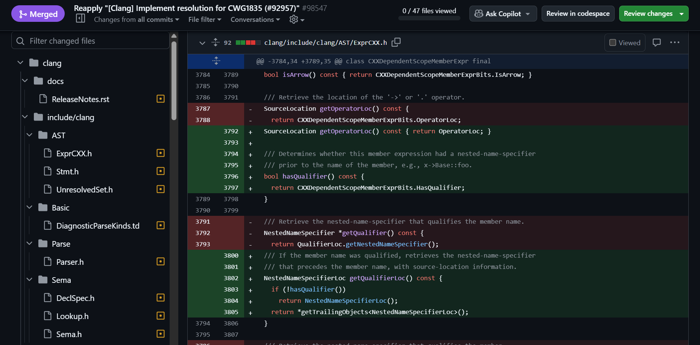

# GenAI-Powered Code Reviewer Bot for OpenMP

A Clang-compatible CLI tool that analyzes OpenMP-related pull requests and suggests review comments using GenAI, trained on historical GitHub data.

## Dependencies

Install the required Python packages:

```bash
pip install -r requirements.txt
```

## Environment Setup

Create a `.env` file in the project root with your GitHub token:

```env
GITHUB_TOKEN=ghp_your_personal_access_token_here
GEMINI_API_KEY=your_gemini_api_key
```

> Make sure your token has at least `read:public_repo` or `repo` scope.

---

## File Structure

```bash
.
├── .env
├── requirements.txt
├── review_openmp_pr.bat
├── review_openmp_pr.sh
├── clang-review-bot/
│   ├── build
│   ├── CMakeLits.txt
│   └── main.cpp
├── data/
│   ├── openmp_prs.json
│   ├── openmp_hunks_comments.json
│   ├── openmp_indexed_closed_prs.json
│   ├── mapping_stats.json
│   ├── faiss_index.idx
│   └── comments_lookup.json
├── src/
│   ├── collect_data.py
│   ├── find_comments.py
│   ├── preprocess_data.py
│   ├── analyze_mappings.py
│   ├── build_vector_db.py
│   ├── diff_utils.py
│   └── suggest_code_review.py

```

## Project Workflow

### 1. Find PRs with Review Comments

```bash
python src/find_comments.py
```

**Output:** `data/openmp_indexed_closed_prs.json`


### 2. Collect PR Data (Diffs + Comments)

```bash
python src/collect_data.py
```

**Output:** `data/openmp_prs.json`


### 3. Map Comments to Code Hunks

```bash
python src/preprocess_data.py
```

**Output:** `data/openmp_hunks_comments.json`


### 4. Analyze Mappings & Generate Stats

```bash
python src/analyze_mappings.py
```

**Output:**

* Summary in terminal
* `data/mapping_stats.json`


### 5. Build a Vector Store

```bash
python src/build_vector_db.py
```

**Output:**

* `data/comments_lookup.json`
* `faiss_index.idx`


### 6. Suggest Code Review Comments

```bash
python src/suggest_code_review.py <pr#>
```

**Dummy Output:**
 ```
📥 Fetching hunks for PR #98547 
🔍 Hunk from clang/include/clang/AST/ExprCXX.h, line 3789
💬 Suggested Comment:
The change introduces a new Qualifier field and associated methods, which aligns with existing conventions for handling nested name specifiers. Consider adding a Profile method overload for NestedNameSpecifier in Type.cpp to ensure proper profiling.
```


---

## CLI Wrapper Script (Linux & Windows)

#### Linux/macOS

```bash
chmod +x review_openmp_pr.sh
./review_openmp_pr.sh <pr#>
```

#### Windows

```bash
review_openmp_pr.bat <pr#>
```

> Make sure python is available in your system's PATH.

## Clang-compatible CLI Tool

We've wrapped the Python-based review engine in a native C++ command-line tool — built like ```clang-tidy```.

### Setup Instructions

#### 1. **Install CMake**
- Download from: https://cmake.org/download/  
- Use installer: `cmake-3.29.2-windows-x86_64.msi`  
> Select *“Add CMake to system PATH”* during install

#### 2. Install LLVM/Clang
- Get prebuilt binaries: [LLVM 20.1.7 Release](https://github.com/llvm/llvm-project/releases)  
- Download: `clang+llvm-20.1.7-x86_64-pc-windows-msvc.tar.xz`  
- Extract and add the `bin/` folder to your system `PATH`

#### 3. Install Visual Studio C++ Build Tools
- Open **Visual Studio Installer** → Modify existing install  
- Select *"Desktop development with C++"*  
- Installs `cl.exe`, CMake integration, and x64 Native Tools

#### 4. **Build the CLI Tool**
Open:  
`x64 Native Tools Command Prompt for VS 2022` (run as Admin)  

Then run:
```bash
cd path\to\clang-review-bot
mkdir build && cd build
cmake ..
cmake --build . --config Release
```

#### 5. **Run the Tool**
From `/build`:
```bash
clang-review <PR#>
```

This will:
- Invoke the Python backend (```suggest_code_review.py```)
- Load the FAISS index + metadata
- Fetch diffs and generate Gemini-powered suggestions


---

## Output File Description

| File                            | Description                             |
| ------------------------------- | --------------------------------------- |
| `openmp_prs.json`               | Raw PRs with review + issue comments    |
| `openmp_hunks_comments.json`    | Comments mapped to file hunks           |
| `mapping_stats.json`            | Summary of comment stats                |
| `openmp_indexed_closed_prs.json`| PRs filtered to contain inline comments |
| `comments_lookup.json`          | store queries and comments for lookup   |
| `faiss_index.idx`               | generated FAISS vector index            |
